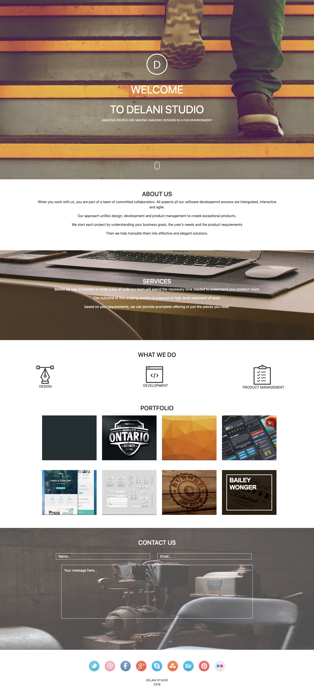

# Delani Studio

## Author

[Abdi-Ali](https://github.com/Abdi-Ali33)

## Description

The Project is about landing page website for a fictional Delani Studio that showing its services and a form to reach out to them

## Screenshot

## Technologies Used

- HTML
- CSS
- Bootstrap
- JS
- JQuery

## Installation / Setup instruction

1. Open Terminal {Ctrl+Alt+T}

2. Clone the project-

   git clone `https://github.com/Abdi-Ali33/-Delani-Studio-Project.git`

3. Navigate to the cloned or downloaded folder
4. Open index.html file with your browser
